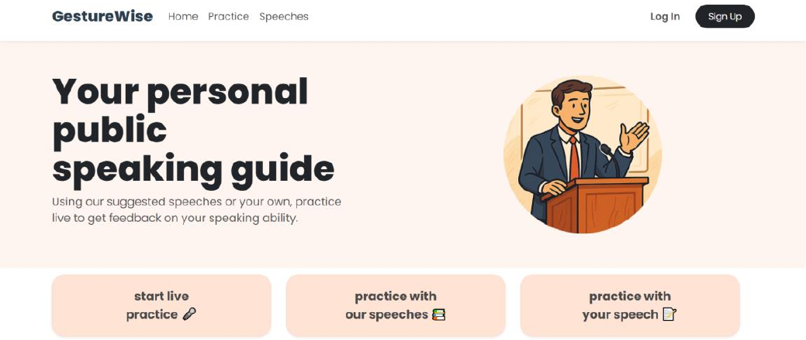
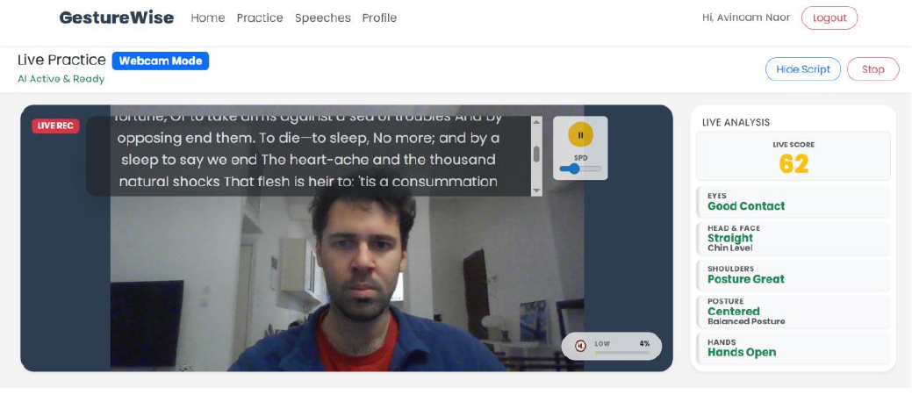
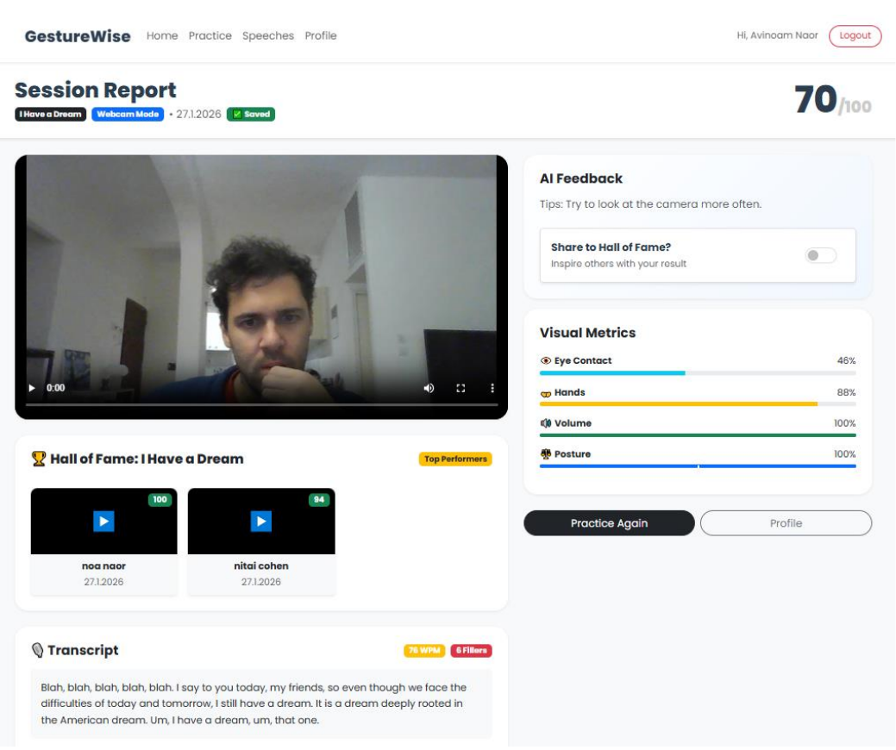

# GestureWise

GestureWise is a full-stack presentation training application designed to help users improve their public speaking through real-time body-language analysis and post-session feedback.

Using webcam input and MediaPipe, the application analyzes visual presentation cues such as eye contact, posture, shoulder alignment, and hand gestures. Users can practice with predefined speeches or in free-practice mode and review their performance after each session.

## Features

* Real-time presentation practice using webcam input
* Eye contact and head orientation analysis
* Posture and shoulder alignment feedback
* Hand gesture analysis
* Live presentation score and feedback
* Post-session performance reports
* Speech transcription
* Predefined speech library and free-practice mode
* User authentication
* Session history and progress tracking
* Gamification system with XP, streaks, and speaker ranks
* Community-based high-scoring presentation examples

## Tech Stack

### Frontend

* React
* Vite
* MediaPipe Tasks Vision
* React Bootstrap
* React Router
* JavaScript

### Backend

* Node.js
* Express.js
* MongoDB
* Mongoose
* JSON Web Tokens (JWT)
* bcryptjs
* Multer
* Deepgram SDK

## Project Structure

```text
final-project/
├── my-app/
│   └── src/
│       ├── assets/
│       ├── components/
│       ├── context/
│       ├── data/
│       ├── hooks/
│       ├── pages/
│       └── utils/
│
└── backend/
    ├── controllers/
    ├── models/
    ├── routes/
    ├── services/
    └── server.js
```

# Running Locally Section

## Running Locally

### Prerequisites

* Node.js
* npm
* MongoDB Atlas account
* Deepgram API key

### 1. Clone the repository

```bash
git clone https://github.com/avinoamnaor/GestureWise.git
cd GestureWise
```

### 2. Configure the backend

Navigate to the backend directory:

```bash
cd backend
npm install
```

Create a `.env` file based on `.env.example`:

```env
PORT=5000
MONGO_URI=your_mongodb_connection_string
JWT_SECRET=your_jwt_secret
DEEPGRAM_API_KEY=your_deepgram_api_key
```

Start the backend:

```bash
node server.js
```

The backend will run on:

```text
http://localhost:5000
```

### 3. Run the frontend

Open another terminal and navigate to the frontend directory:

```bash
cd my-app
npm install
npm run dev
```

Vite will provide a local development URL, typically:

```text
http://localhost:5173
```

Open the URL in your browser to use GestureWise.


## How It Works

The React frontend captures webcam input and uses MediaPipe Tasks Vision to analyze the speaker's body language during a practice session.

The Node.js and Express backend handles authentication, session data, speeches, user progress, and communication with external services. MongoDB is used for persistent data storage, and Deepgram is used for speech transcription.

After completing a presentation, users can review their recorded session and receive a performance report containing scores and feedback to help identify areas for improvement.

## Screenshots

### Home Page



### Live Practice

Real-time presentation analysis with feedback on eye contact, posture, shoulder alignment, and hand gestures.



### Session Report

Post-session performance report with visual metrics, feedback, transcription, and session results.


